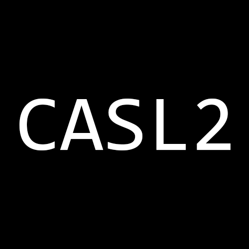

<p align="center">
  
</p>
<p align="center">
    CASL2 support for Visual Studio Code<br/>
</p>

## Screenshot


## Features
- Syntax highlight

## Installation
Launch Visual Studio Code Quick Open (Ctrl+P), paste the following command, and press enter.
```
ext install casl2
```

## More info
[Visual Studio Code Marketplace - CASL2](https://marketplace.visualstudio.com/items?itemName=MaxfieldWalker.casl2)

## License
MIT
